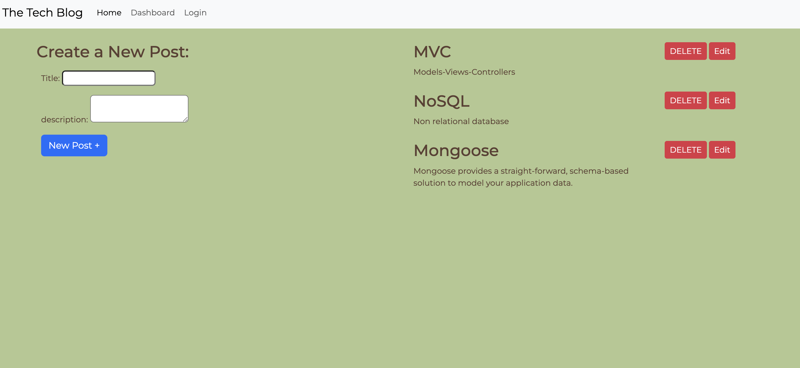

# dev-blog

## Table of Contents

- [Description](#description)
- [installation](#installation)
- [Usage](#usage)
- [License](#license)
- [Contributing](#contributing)
- [Tests](#tests)
- [Questions](#questions)

## Description

This app is a CMS-style blog site similar to a Wordpress site, where developers can post their blogs and comment on developers' posts as well. When visiting the site for the first time, the user is presented with the homepage, which includes existing blog posts if any. next, when the user clicks on other links, the user is prompted to either sign in or sign up. Once the user is logged in, the user has the option to go to their dashboard and create a new post. When the user is in the homepage, the user has the option to comment on posts.

## Installation

express-handlebars, MySQL2, Sequelize, dotenv package, bcrypt package, express-session, connect-session-sequelize

## Usage

Click on one of the links in the navigation bar to go to a specific page.

## License

Licensed under the [MIT](http://choosealicense.com/licenses/mit/) license.

## Contributing

## Tests

## Questions

[The URL of the GitHub profile](https://github.com/LizaS2022).
